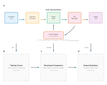
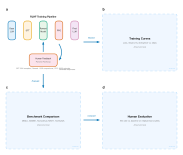
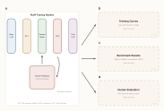

# Academic Figures — Claude Skill for Publication-Ready Scientific Illustrations

Generate editable SVG figures for academic journals directly in [Claude](https://claude.ai). Describe your research story, and Claude produces 2–3 publication-ready figure variants with proper typography, colorblind-safe palettes, and labeled placeholders for your data plots — all editable in **Inkscape**, **Ipe**, or any SVG editor.

<p align="center">
  
</p>

## What It Does

| You say... | Claude generates... |
|---|---|
| *"4-panel figure: RLHF pipeline schematic, training curves, benchmark results, human evaluation"* | 2–3 SVG variants with the pipeline drawn as vector graphics and dashed placeholders for your data plots |
| *"Graphical abstract for my paper on chain-of-thought reasoning"* | A unified TOC-sized (82.55 × 44.45 mm) visual with iconic representations |
| *"Use NeurIPS formatting with my lab colors: navy and gold"* | All variants formatted to specs with your custom palette applied |

**Key features:**

- **Journal-compliant** — built-in specs for Nature, Science, Cell, ACS, IEEE, and Elsevier (exact column widths, font sizes, margins)
- **Editable SVG** — all text is live `<text>` elements, elements are in named Inkscape layers, ready for post-processing
- **Plot placeholders** — dashed boxes with dimensions so you know exactly what size to export your matplotlib/Julia plots
- **Colorblind-safe** — defaults to the [Wong 2011](https://www.nature.com/articles/nmeth.1618) palette; warns you if your custom colors have contrast issues
- **Multiple variants** — each variant differs in both layout (horizontal, grid, hierarchical, top-bottom) AND visual style (minimal, color-accented, warm muted)

## Installation

### Prerequisites

- A [Claude Pro](https://claude.ai) account with the **Code Execution and File Creation** feature enabled (Settings → Feature Preview)

### Setup

1. **Download the skill folder:**

   ```bash
   git clone https://github.com/<your-username>/academic-figures.git
   ```

2. **Upload to a Claude Project:**

   - Go to [claude.ai](https://claude.ai) → **Projects** → create or open a project
   - In the project's **knowledge base**, upload the entire `academic-figures/` folder (containing `SKILL.md` and the `references/` subfolder)

   Alternatively, upload the packaged `.skill` file from [Releases](../../releases) if available.

3. **Start a conversation** in that project and describe your figure. Claude will read the skill files and generate SVGs.

### Quick Test

In a conversation within your project, try:

> Create a 4-panel figure for a study on improving LLM reasoning via RLHF. Panel (a): RLHF training pipeline schematic (pre-training → SFT → reward modeling → PPO). Panel (b): placeholder for training loss and reward curves. Panel (c): placeholder for benchmark comparison bar chart (MMLU, GSM8K, HumanEval). Panel (d): placeholder for human evaluation results. Target journal: Nature.

## Usage

### Multi-Panel Research Figures

Describe the panels and their content. Claude will determine the narrative flow and generate layout variants:

```
Create a figure for my paper on efficient fine-tuning of LLMs:
- Panel a: LoRA architecture schematic (frozen weights + low-rank adapters)
- Panel b: placeholder for training loss curves (LoRA vs full fine-tuning vs prefix tuning)
- Panel c: placeholder for benchmark radar chart (MMLU, GSM8K, HumanEval, MATH, TruthfulQA)
- Panel d: placeholder for parameter efficiency comparison (table or bar chart)
Target: ICML / NeurIPS (single column, 5.5 inch width)
```

### Graphical Abstracts & TOC Graphics

Specify the figure type explicitly:

```
Create a graphical abstract for my paper. 
The story: We collect human preference data on LLM outputs, train a reward model, 
then use PPO to fine-tune the base model, achieving 23% improvement in helpfulness 
while maintaining safety. 
Use blue (#0072B2) and orange (#E69F00) as my two main colors.
```

### Custom Color Schemes

Provide colors in any format:

```
Use these colors: navy (#003366), amber (#FFB000), and teal (#009B8D)
```

```
Use the ACS preset palette
```

```
Make it monochrome — grayscale only
```

### Refinement

After Claude generates variants, request changes:

```
I like Variant B. Can you:
- Add a "Chain-of-Thought" annotation box between the SFT and Reward Model stages
- Make the arrows thicker
- Swap panels (c) and (d) so human eval is bottom-left
- Fit to single column width (89mm)
```

## Supported Journals

| Journal / Venue | Single Column | Double Column | Font |
|---------|--------------|---------------|------|
| **Nature** | 89 mm | 183 mm | Helvetica 7–8 pt |
| **Science** | 90 mm | 183 mm | Helvetica 7–8 pt |
| **Cell** | 85 mm | 174 mm | Helvetica/Arial 6–8 pt |
| **ACS** | 84.7 mm (3.33 in) | 177.8 mm (7 in) | Arial 6–8 pt |
| **IEEE** | 88.9 mm (3.5 in) | 181.9 mm (7.16 in) | Times New Roman 8–10 pt |
| **Elsevier** | 90 mm | 190 mm | Varies by journal |
| **NeurIPS / ICML** | 139.7 mm (5.5 in) | — | Times 10 pt |

TOC graphic size (ACS): 82.55 × 44.45 mm (3.25 × 1.75 in)

## Examples

Three layout variants for a study on *"Improving LLM Reasoning via Reinforcement Learning from Human Feedback"*:

### Variant A — Top-Bottom, Clean Minimal

RLHF pipeline schematic on top (Pre-trained LLM → SFT → Reward Model → PPO → Aligned LLM, with Human Feedback loop), three data placeholders below (training curves, benchmarks, human evaluation). Thin lines, white background.


### Variant B — 2×2 Grid, Color-Accented

Balanced grid: pipeline schematic (top-left), training curves (top-right), benchmark comparison (bottom-left), human evaluation (bottom-right). Tinted box fills with bolder arrows.



### Variant C — Hierarchical Hero, Muted Warm

Large hero panel (RLHF pipeline) on the left, stacked data panels on the right. Cream background with warm earthy tones and curved flow arrows.



## Repo Structure

```
academic-figures/
├── README.md                          ← You are here
├── SKILL.md                           ← Core instructions and workflow
├── LICENSE
├── references/
│   ├── journal-styles.md              ← Journal specs, fonts, color palettes
│   └── svg-guide.md                   ← SVG component library and layout algorithms
└── examples/                          ← Sample outputs
    ├── example_variant_A.svg
    ├── example_variant_B.svg
    └── example_variant_C.svg
```

### What Each File Does

| File | Purpose |
|------|---------|
| `SKILL.md` | Main skill definition — tells Claude the workflow, design rules, quality checklist, and when to trigger. Claude reads this first. |
| `references/journal-styles.md` | Exact dimensions, font specs, and color palettes for Nature, Cell, ACS, IEEE, Elsevier, Science. Also covers graphical abstract and TOC sizing. |
| `references/svg-guide.md` | Python code templates for generating SVG components — arrows, boxes, placeholders, schematics, layout algorithms. Includes arrow spacing rules and overlap prevention. |

## Design Principles

The skill enforces quality rules to avoid common pitfalls in generated figures:

- **Arrow minimum length**: 10 mm — no cramped, illegible arrows
- **Arrow label clearance**: Labels are 3.5 mm from the arrow line, never overlapping boxes
- **Text-boundary separation**: Panel labels sit 2.5 mm above content areas, never on border lines
- **Dimension text containment**: Size annotations stay inside placeholder rects
- **Adaptive box labels**: Text automatically shortens when panels are narrow
- **Colorblind safety**: Default palette is Wong 2011; custom palettes get a contrast check

## Editing the Output

The SVGs are designed for post-processing:

1. **Inkscape**: Open directly. All elements are in named layers (Panel a, Panel b, Flow Arrows, etc.). Ungroup and edit freely.
2. **Ipe**: Import SVG via File → Import. Text remains editable.
3. **matplotlib / Julia Plots**: Export your plots as SVG or high-DPI PNG at the exact dimensions shown in the placeholder boxes, then paste them in.
4. **Adobe Illustrator**: Opens natively. Layers map to AI layers.

## Contributing

Contributions welcome — especially:

- **New schematic components** (transformer architectures, attention diagrams, training loops, model comparisons)
- **Additional journal/venue style specs** (RSC, Wiley, Springer, ACL, AAAI, etc.)
- **Preset color palettes** for specific fields
- **Bug reports** — if text overlaps a line, an arrow is too short, or a dimension is wrong, please open an issue with the SVG attached

## License

[MIT](LICENSE)
